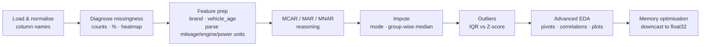

  

  

  
  
  
  
  

---

## 🧠 What I Did

Week 2 of a Data Science internship: a deeper EDA on a **CarDekho used-car dataset (1,234 cars × 13 columns, 1,083 missing values)** focused on *why* data is missing, how to fill it responsibly, and how outlier methods disagree on skewed data. **Individual assignment.**

## 🔍 Highlights

| Topic | What I found / did |
|---|---|
| **Missingness** | `new_price` is **85% missing**; `power` and `engine` also have gaps. Missingness varies by listing, so it's not purely random (MAR-style) |
| **Unit parsing** | Extracted numbers from strings like `"18.5 kmpl"`, `"1197 CC"`, `"82 bhp"` with regex |
| **Imputation** | `owner_type` → mode · `mileage` → median **within each fuel type**, so diesel and petrol cars aren't averaged together |
| **Outliers** | **IQR flagged 22** high prices, **Z-score only 2** — prices are right-skewed (kurtosis ≈ 429), which inflates the std and hides outliers from Z-score |
| **Business rule** | Expensive cars ≤ 5 years old are flagged `is_premium_outlier` and **kept** — they're likely genuine, not errors |
| **Insights** | Diesel cars sell for more than petrol; automatics cost more in most fuel types; price tracks power and engine size |
| **Part E — SQL research** | When to use SQL vs Pandas, `SELECT`, `JOIN`, `GROUP BY` |

Previous week: [Titanic EDA →](https://github.com/ahmadmuzii/week1-eda-assignment)

  

